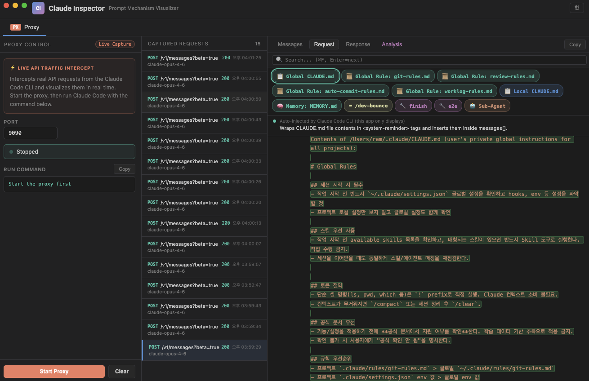

<div align="center">

# Claude Inspector

**See what Claude Code actually sends to the API.**

MITM proxy that intercepts Claude Code CLI traffic in real-time<br>
and visualizes all 5 prompt augmentation mechanisms.

[Install](#install) · [What You'll Learn](#what-youll-learn) · [Proxy Mode](#proxy-mode) · [How It Works](#how-it-works)

[](LICENSE)
[](https://github.com/kangraemin/claude-inspector/releases/latest)
[](https://github.com/kangraemin/claude-inspector/releases/latest)

**English** | [한국어](README.ko.md)

</div>

---

<p align="center">
  
</p>

<p align="center">
  
</p>

## What You'll Learn

All discovered from **real captured traffic**. See what Claude Code hides from you.

### 1. CLAUDE.md is injected into every single request

You type `hello`. Claude Code silently prepends **~12KB** before your message:

| Block | What's inside | Size |
|-------|--------------|------|
| `content[0]` | Available skills list | ~2KB |
| `content[1]` | CLAUDE.md + rules + memory | **~10KB** |
| `content[2]` | What you actually typed | few bytes |

**Injection order:** Global CLAUDE.md → Global rules → Project CLAUDE.md → Memory

This ~12KB payload is re-sent with **every request**. A 500-line CLAUDE.md quietly burns tokens on every API call. Keep it lean.

### 2. MCP tools are lazy-loaded — watch `tools[]` grow

Built-in tools (27) ship their full JSON schemas every request. MCP tools don't — they start as **names only**.

**Watch the count change in real-time:**

| Step | What happens | `tools[]` count |
|------|-------------|-----------------|
| Initial request | 27 built-in tools loaded | **27** |
| Model calls `ToolSearch("context7")` | Full schema for 2 MCP tools returned | **29** |
| Model calls `ToolSearch("til")` | 6 more MCP tool schemas added | **35** |

Unused MCP tools never consume tokens. The Inspector lets you watch `tools[]` grow as the model discovers what it needs.

### 3. Images are base64-encoded inline

When Claude Code reads a screenshot or image file, the image is **base64-encoded and embedded directly** in the JSON body:

```json
{
  "type": "image",
  "source": {
    "type": "base64",
    "media_type": "image/png",
    "data": "iVBORw0KGgo..."
  }
}
```

A single screenshot can add **hundreds of KB** to the request payload. The Inspector shows you the exact size.

### 4. Skill ≠ Command — completely different injection paths

Typing `/something` triggers one of three completely different mechanisms:

| | Local Command | User Skill | Assistant Skill |
|---|---|---|---|
| **Example** | `/mcp`, `/clear` | `/commit` | `Skill("finish")` |
| **Who triggers** | User | User | Model |
| **Injection** | `<local-command-stdout>` | Full prompt in user msg | `tool_use` → `tool_result` |
| **Model sees** | Result only | Full prompt | Full prompt |

**Commands** run locally and only pass the result. **Skills** inject the entire prompt text — and it **stays in every subsequent request** until the session ends.

### 5. Previous messages pile up — use `/clear` often

Claude Code re-sends the **entire** `messages[]` array with every request:

```json
{
  "messages": [
    {"role": "user",      "content": [/* ~12KB CLAUDE.md */ , "hello"]},
    {"role": "assistant", "content": [/* tool_use, thinking, response */]},
    {"role": "user",      "content": [/* ~12KB CLAUDE.md */ , "fix the bug"]},
    {"role": "assistant", "content": [/* tool_use, thinking, response */]},
    // ... 30 turns = 30 copies of CLAUDE.md + all responses
  ]
}
```

| Turns | Approx. cumulative transfer |
|-------|---------------------|
| 1 | ~15KB |
| 10 | ~200KB |
| 30 | ~1MB+ |

Most of it is old conversation you no longer need. As it grows:

- **Cost increases** — more input tokens per request means higher API bills
- **Context window fills up** — once the limit is hit, older messages get auto-compressed and detail is lost
- **Responses slow down** — larger payloads take longer to process

Running `/clear` resets the context and drops the accumulated weight. Clear early, clear often.

### 6. Sub-agents run in fully isolated contexts

When Claude Code spawns a sub-agent (via the `Agent` tool), it creates a **completely separate API call**. The parent and sub-agent have entirely different `messages[]`:

| | Parent API call | Sub-agent API call |
|---|---|---|
| **`messages[]`** | Full conversation history (all turns) | Only the task prompt — **no parent history** |
| **CLAUDE.md** | Included | Included (independently) |
| **tools[]** | All loaded tools | Fresh set |
| **Context** | Accumulated | Starts from zero |

The Inspector captures both calls side by side, so you can compare what each one sees.

## Install

### Homebrew (Recommended)

```bash
brew install --cask kangraemin/tap/claude-inspector && open -a "Claude Inspector"
```

### Direct Download

Download the `.dmg` from the [Releases](https://github.com/kangraemin/claude-inspector/releases/latest) page.

| Mac (Apple Silicon) | Mac (Intel) |
|---|---|
| [Claude-Inspector-arm64.dmg](https://github.com/kangraemin/claude-inspector/releases/latest) | [Claude-Inspector-x64.dmg](https://github.com/kangraemin/claude-inspector/releases/latest) |

### Uninstall

```bash
brew uninstall --cask claude-inspector
```

## Development

```bash
git clone https://github.com/kangraemin/claude-inspector.git
cd claude-inspector
npm install
npm start
```

## Proxy Mode

Intercept **real** Claude Code CLI traffic via a local MITM proxy.

```
Claude Code CLI  →  Inspector (localhost:9090)  →  api.anthropic.com
```

**1.** Click **Start Proxy** in the app<br>
**2.** Run Claude Code through the proxy:

```bash
ANTHROPIC_BASE_URL=http://localhost:9090 claude
```

**3.** Every API request/response is captured in real-time.

## Tech Stack

| Layer | What | Why |
|-------|------|-----|
| **Electron** | Desktop shell, IPC between main/renderer | Native macOS titlebar (`hiddenInset`), code-signed + notarized DMG distribution |
| **Vanilla JS** | Zero frameworks, zero build steps | Entire UI in a single `index.html` — no bundler, no transpiler, no React |
| **Node `http`/`https`** | MITM proxy on `localhost` | Intercepts Claude Code ↔ Anthropic API traffic, reassembles SSE streams into complete response objects |
| **highlight.js + marked** | Syntax highlighting & markdown | Renders JSON payloads and markdown content inline |

> **Privacy**: All traffic stays on `localhost`. Nothing is sent anywhere except directly to `api.anthropic.com`.

## License

MIT
